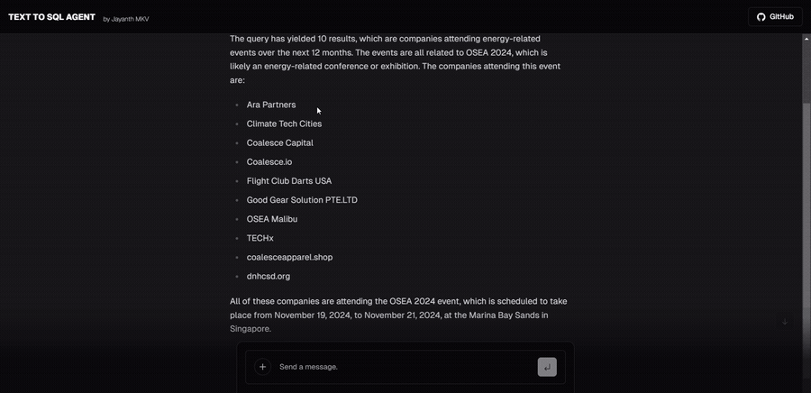

<div align="center">

# Advanced Agents Cookbooks

**Practical agent-engineering lessons and an interactive data assistant for studying planning, memory, tools, and streamed experiences.**

[](ai-agents-langgraph)
[](ai-sql-agent/ai-sql-agent-frontend/package.json)
[](ai-sql-agent/ai-sql-agent-backend/pyproject.toml)

[Cookbooks](#cookbook-map) · [SQL Agent](#featured-sql-agent) · [Quick start](#quick-start) · [Status](#status-and-reproducibility)

</div>

## What is it?

This repository combines two notebook learning tracks with one larger application. The notebooks explore agent behavior and long-term memory; the interactive assistant connects natural-language questions to structured data with streamed progress and results.

The directories are independent. There is no root package, shared environment, or command that runs the entire collection.

## Cookbook map

| Track | Contents | Focus |
| --- | ---: | --- |
| [`ai-agents-langgraph/`](ai-agents-langgraph) | 5 notebooks + course notes | Graph basics, an agent from scratch, streaming/memory, human-in-the-loop control, and an essay-writing agent |
| [`ai-agents-long-term-memory-langgraph/`](ai-agents-long-term-memory-langgraph) | 4 notebooks | A baseline email assistant extended with semantic, episodic, and procedural memory |
| [`ai-sql-agent/`](ai-sql-agent) | FastAPI backend + Next.js frontend + notebooks/data | Natural-language questions translated into guarded SQLite queries with streamed progress and formatted results |

## Featured SQL Agent

The preview below is cut from the real checked-in SQL Agent recording. It links to the complete 69-second MP4.

<div align="center">
  <a href="ai-sql-agent/ai-sql-agent-frontend/public/sql-agent.mp4">
    
  </a>
</div>

The backend implements two streaming endpoints:

- `POST /query` runs the LangChain SQL agent against the configured SQLite database.
- `POST /mockquery` streams a deterministic demonstration response.

The production query path requires a Groq key and uses the `llama3-70b-8192` model configured in the backend.

## Quick start

### SQL Agent backend

Prerequisites: Python 3.11.9 and Poetry.

```bash
cd ai-sql-agent/ai-sql-agent-backend
poetry install
```

Create `.env`:

```env
GROQ_API_KEY=your_key_here
```

Start FastAPI:

```bash
poetry run python main.py
```

The API is available at `http://localhost:8000`; interactive docs are at `http://localhost:8000/docs`.

### SQL Agent frontend

```bash
cd ai-sql-agent/ai-sql-agent-frontend
pnpm install
pnpm dev
```

The package declares pnpm 8.6.3 and serves the app at `http://localhost:3000`. The current chat component calls a deployed backend URL directly. Authentication/history features also reference Vercel KV and NextAuth, but no `.env.example` is committed; treat those integrations as configuration work rather than a verified zero-config path.

### Notebook tracks

Create a Python environment, install Jupyter, then install the imports needed by the notebook you intend to study:

```bash
python -m venv .venv
source .venv/bin/activate
python -m pip install jupyterlab
jupyter lab
```

## Status and reproducibility

| Area | Status |
| --- | --- |
| SQL Agent backend | **Implemented** — FastAPI, Groq/LangChain agent, SQLite data, query streaming, and mock streaming are present. |
| SQL Agent frontend | **Implemented with external configuration** — the UI, real recording, and screenshots are present; deployed backend and optional auth/KV services are external. |
| LangGraph notebooks | **Mixed reproducibility** — dependencies are unpinned, and the essay notebook imports an untracked local `helper` module. |
| Long-term-memory notebooks | **Incomplete locally** — notebooks import an untracked local `prompts` module. |
| Tests | **Limited** — one backend test module is present; no root test command or notebook execution CI exists. |
| License | **Per-directory only** — nested SQL Agent components include license files; the repository root does not define one license for the entire collection. |
